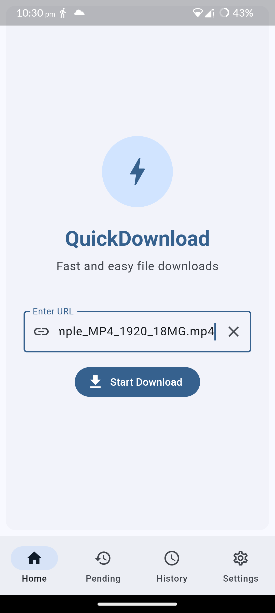
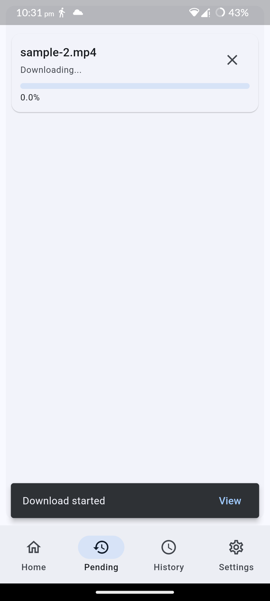
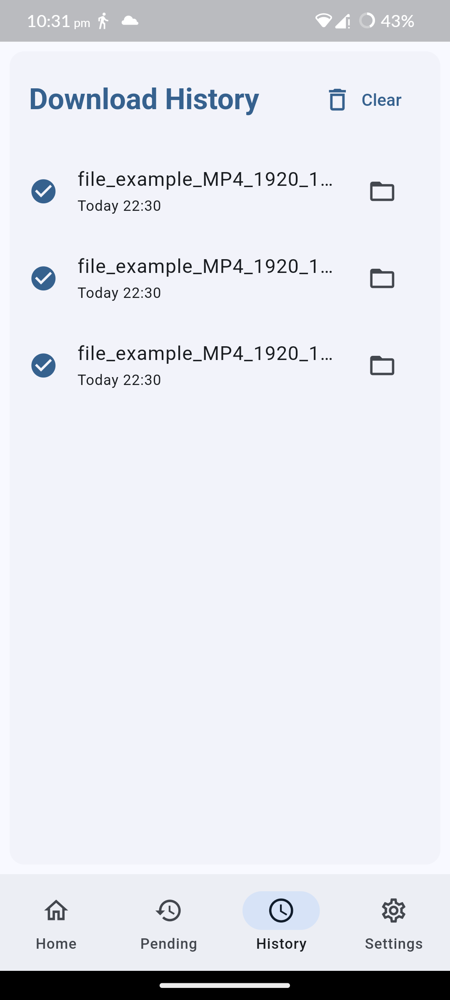
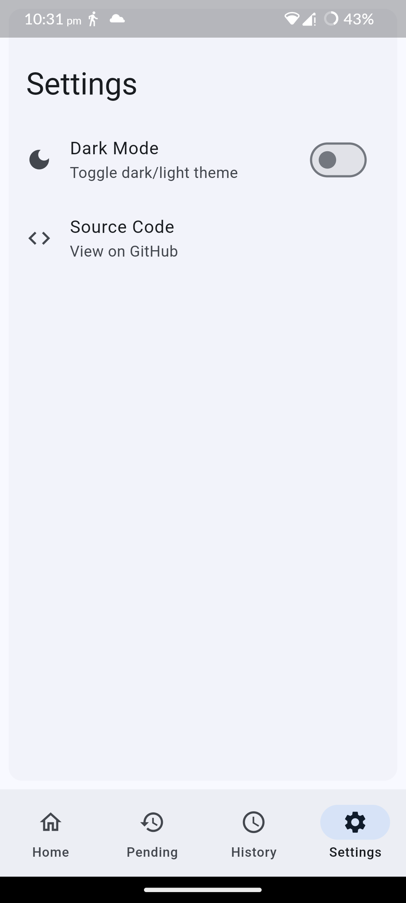

# Download-Manager

<div align="center">
<div>
   
   
   
   
</div>
</div>

## Getting Started

### Prerequisites

Ensure you have the following installed on your development machine:

- Flutter SDK
- Dart SDK
- A suitable IDE such as Visual Studio Code or Android Studio
- An emulator or physical device for testing

### Installation

1. Install the necessary dependencies:

   ```sh
   flutter pub get
   ```

2. Run the application:

   ```sh
   flutter run
   ```

